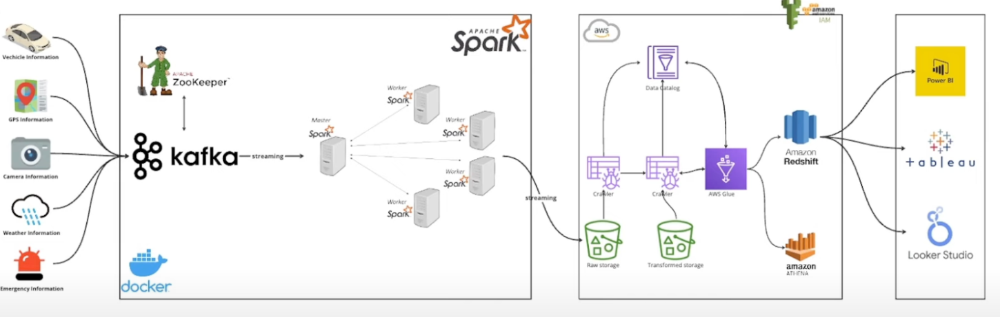

# SmartCity Real-Time Data Streaming Pipeline

## Table of Contents
- [Overview](#overview)
- [Architecture Overview](#architecture-overview)
- [Components and Workflow](#components-and-workflow)
- [Technology Stack](#technology-stack)

## Overview

This project demonstrates the construction of a real-time data streaming pipeline tailored for smart city applications. It integrates technologies like IoT devices, Apache Kafka, Apache Spark, and various AWS services (S3, Glue, Athena, Redshift) to efficiently ingest, process, analyze, and store vast amounts of real-time data.

## Architecture Overview

## Components and Workflow

The streaming pipeline consists of the following core components:

- **IoT Data Simulation**: The pipeline simulates IoT data reflecting a vehicle journey from London to Birmingham. The generated data includes vehicle specifics, GPS tracking, camera imagery, weather updates, and emergency notifications. This simulated data is pushed continuously to Kafka for streaming purposes ([main.py script](https://github.com/yangforbig/SmartCity-End-to-End-Data-Engineering/blob/main/jobs/main.py)).

- **Apache Kafka with ZooKeeper**: Kafka serves as the robust messaging backbone, enabling real-time data transfer from IoT sensors to processing frameworks. ZooKeeper manages and coordinates Kafka clusters, ensuring efficient data handling even at massive scales typical of smart city infrastructures.

- **Apache Spark**: Spark is employed as a high-performance data processing engine, retrieving streaming data directly from Kafka and subsequently saving it to Amazon S3 cloud storage ([iot-data.py script](https://github.com/yangforbig/SmartCity-End-to-End-Data-Engineering/blob/main/jobs/iot-data.py)).

- **AWS Cloud Services**:
    - **S3 Storage**: Secure data storage for raw and processed datasets.
    - **AWS Glue**: Data transformation and cataloging.
    - **AWS Athena**: Serverless querying of stored data.
    - **AWS Redshift**: Data warehouse for large-scale analytics.

## Technology Stack
- Python
- Apache Kafka
- Apache Spark
- AWS S3
- AWS Glue
- AWS Athena
- AWS Redshift
- Docker

